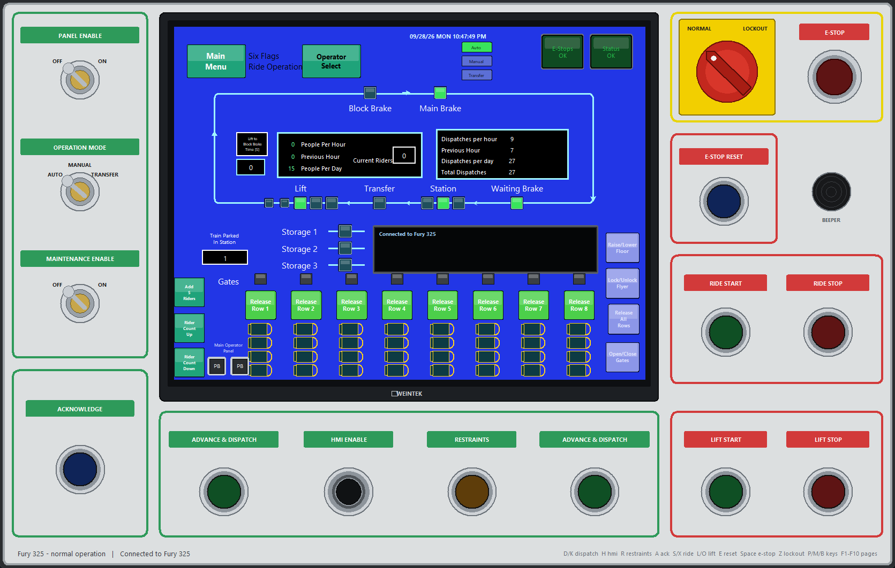

# NoLimits 2 Remote Control DLL (NL2Bridge)

NL2Bridge is a DLL that loads into the running **NoLimits 2** roller coaster simulator and opens a TCP control API. Physical control panels, PLCs, Arduinos and PC programs can then read the ride's state and operate it like a real ride:

- **Read** block states, trains and their positions, stations, gates, restraints (per row), seat capacity of the train in the station (and whether it's a custom script-drawn train), switches, transfer tables, track sensors and events.
- **Control** block modes, E-stop, simulation reset, block advance, dispatch, gates, restraints (all rows or one row), floors, flyer seats, switches and transfer tables.
- **Drive devices**: open/close brakes, turn lifts and transport wheels on, off, forward or backward, stop and restart lift chains in any block mode, change lift and transport speeds live, lash trains to storage tracks.
- **Script** coasters set to Scripted operation: your program becomes the ride's block logic.

It works with normal coasters: no park script and no changes to the park file. The repo also includes a complete **PC ride control panel** that runs a coaster the way an operator would, on the game PC or on another PC on the network.



> Unofficial fan project, not affiliated with or endorsed by Ole Lange / NoLimits. It reads and calls the game's internal functions, so it only works with the game build it was made for (see [Compatibility](#compatibility)). Use at your own risk and keep backups of your parks.

## Contents
| Path | What it is |
|---|---|
| `src/` | The DLL (`nl2bridge.cpp`, `offsets.h`, `sensors.inc`, `restraints.inc`) and the injector (`injector.cpp`) |
| `client/nl2bridge.py` | Python client library: one method per command, name lookups, errors with the game's reason |
| `client/nl2bridge_client.py` | Command-line tool for quick tests |
| `client/nl2_viewer.py` | Read-only live block and train viewer |
| `controller/` | The NL2 Ride Control Panel (Python/tkinter) |
| `examples/` | Small Python and Node.js programs, plus an Arduino ride control panel (sketch, library and USB serial gateway) |
| `scriptbuilder/sb_io.py` | Work in progress: joystick / keyboard / Arduino (serial) / Modbus TCP inputs and lamp outputs for physical panels |
| `docs/` | [API guide](docs/API.md), [wire protocol](docs/PROTOCOL.md), [control panel](docs/CONTROLLER.md), [reverse-engineering notes](docs/RE_NOTES.md) |

Prebuilt `NL2Bridge.dll` and `NL2BridgeInjector.exe` are on the [Releases](../../releases) page.

## Quick start
1. Download the latest release and unzip it (keep `NL2Bridge.dll` and `NL2BridgeInjector.exe` together).
2. Run `NL2BridgeInjector.exe`, then start NoLimits 2 from Steam. The injector waits for the game and loads the DLL into it. (Injecting into a game that is already running also works, but sensor names are only captured for parks loaded afterwards.)
3. Open a park and start **play mode**.
4. Check `NL2Bridge.log` next to the DLL: every symbol should say `OK`, ending with `server: listening on port 15152`.
5. Try it:
   ```
   python client/nl2bridge_client.py coasters
   python client/nl2bridge_client.py blocks 0
   python controller/nl2_controller.py
   ```

The bridge stays loaded until the game exits. To load a different build in the same game session, give the DLL a new file name (a DLL can only be loaded once per process).

### Port and network
- Default port **15152**. Put a text file `<dll name>.port` containing another port number next to the DLL to change it.
- For temporary TCP diagnostics, create an empty `<dll name>.trace` file next to the DLL before injection. The log then includes receive sizes, query/request IDs, reply sizes and handler duration. Remove the file and restart the game to disable tracing. Game refusal reasons are logged even without tracing.
- The bridge listens on all network interfaces so panels can run on other PCs. It has **no authentication**: only allow the port through the firewall on a trusted private network (see [Running the panel on a different PC](docs/CONTROLLER.md#running-the-panel-on-a-different-pc)).

## Programming against it
Python:
```python
from nl2bridge import NL2Bridge

with NL2Bridge("127.0.0.1", 15152) as nl:
    c = nl.coaster("Fury 325")
    nl.set_block_mode(c, "manual")
    nl.set_manual_dispatch(c, "Station", True)
    nl.close_restraints(c, "Station"); nl.close_gates(c, "Station")
    nl.dispatch(c, "Station")

    lift = nl.block_id(c, "Lift")
    speed = nl.device_params(c, lift)["lift"]["speed"]
    nl.set_device_params(c, lift, "lift", speed=0)      # LIFT STOP
    nl.set_device_params(c, lift, "lift", speed=speed)  # LIFT START
```

- [docs/API.md](docs/API.md): concepts (block modes, what works when), full Python reference and recipes.
- [docs/PROTOCOL.md](docs/PROTOCOL.md): the binary protocol for any language (C#, C++, Node.js, a PLC with TCP sockets, ...). It uses the same framing as NoLimits 2's official telemetry server.
- [examples/](examples/): monitor, dispatch cycle, lift stop/start and a Node.js client.
- [examples/arduino/](examples/arduino/): build a physical panel with an Arduino. It includes a library with every API call, an example panel for an Uno (dispatch, gates, restraints, single-row release, E-stop/reset, lift start/stop, manual mode, transfer, advance, lamps) and a USB serial gateway.
- [controller/](controller/): a complete ride controller. `ride_logic.py` is the best example of a real program against the API.

## The NL2 Ride Control Panel
A replica operator console: PANEL ENABLE / OPERATION MODE / MAINTENANCE keys, E-STOP with LOCKOUT, illuminated pushbuttons with the startup sequence of a real ride, and a touch-screen HMI with the train's rows, a live track overview, station, blocks, transfer, maintenance, alarms and daily-test pages. It can run on the game PC or any other PC on the network.

See [docs/CONTROLLER.md](docs/CONTROLLER.md).

## Compatibility
- **NoLimits 2 Steam build**, `nolimits2stm.exe` with PE timestamp 0x696F4E97 (2026-01-20). Other versions will most likely not work until `src/offsets.h` is updated.
- The DLL checks the bytes of every game function before using it. If a game update changes them it logs `FAIL` and refuses requests instead of crashing the game.
- Windows 10/11 x64. The Python tools need Python 3.8+ (tkinter for the GUIs).

## Building

Version **1.2.1** keeps API 8 and all ride-command behavior. Replies now retry partial socket writes until the complete frame is sent, or close the connection on failure. This prevents truncated frames under socket backpressure. Optional tracing helps distinguish transport failures from game refusals. No game offsets or control logic changed.

The portable transport regression test covers fragmented writes of a maximum-size frame, failures after partial progress, zero-byte sends, and empty output:

```powershell
g++ -std=c++17 -static -o dist/send_all_test.exe tests/send_all_test.cpp
dist/send_all_test.exe
```
MinGW-w64 (for example MSYS2 `mingw-w64-x86_64-gcc`):
```
g++ -O2 -std=c++17 -shared -static -o NL2Bridge.dll src/nl2bridge.cpp -lws2_32 -lpsapi
g++ -O2 -municode -static -o NL2BridgeInjector.exe src/injector.cpp
```
Or run `build.ps1`, which writes both to `dist/`.

## How it works
- The injector loads the DLL with `LoadLibraryW` in a remote thread. The game executable on disk is never modified.
- Every request runs while holding the game's own simulation/script lock (the same lock NL2's script API takes), and calls the game's own functions: the same code the in-game panel buttons, the script API and the telemetry server use. The game's safety checks still apply; refusals come back with the game's own reason.
- Two small hooks capture sensor events and names; one hook animates individual restraint rows.
- Details, addresses and structure layouts: [docs/RE_NOTES.md](docs/RE_NOTES.md).

## License
MIT, see [LICENSE](LICENSE). NoLimits and NoLimits 2 are trademarks of their respective owners.
