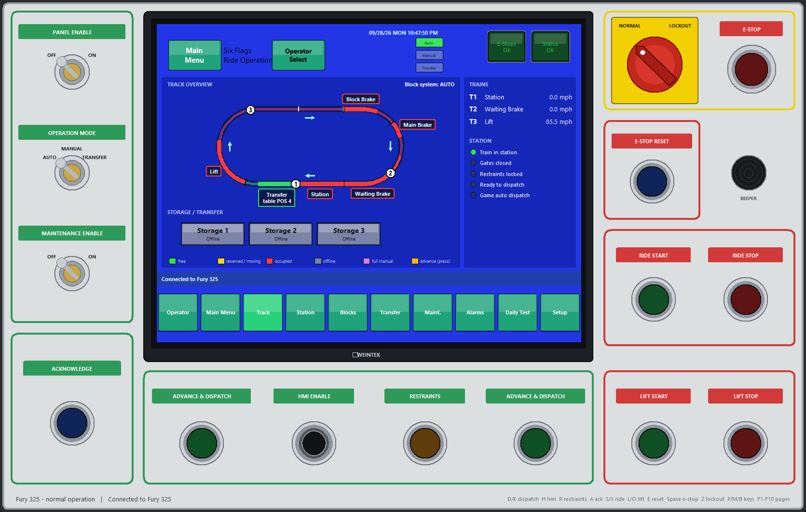

# NL2 Ride Control Panel

`controller/nl2_controller.py` is a full PC ride control panel for NoLimits 2 built on NL2Bridge. It replicates a real operator console: key switches, E-STOP and LOCKOUT, illuminated pushbuttons and a touch-screen HMI. It is also the reference example of how to program a complete ride controller against the bridge: all the ride logic is in `controller/ride_logic.py`.


## Running it
Needs Python 3.8+ with tkinter (included with the python.org Windows installer). No other packages are needed.

```
python controller/nl2_controller.py                          # game on this PC, port 15152
python controller/nl2_controller.py --host 192.168.1.20      # game on another PC
python controller/nl2_controller.py --port 15153 --coaster "Fury 325" --scale 0.8
```

Settings are saved in `controller/settings.json`. You can also change them in the app: **Main Menu > Setup > SETTINGS...**, or the **CONNECTION SETTINGS** button on the "no connection" screen.

### Running the panel on a different PC
The panel only talks to NL2Bridge over TCP, so it can run on any PC on the same network as the game (a laptop next to the sim rig, a touch-screen PC in a mock control booth, ...).

1. On the **game PC**: inject NL2Bridge as usual and find its IP address (`ipconfig`, e.g. `192.168.1.20`).
2. On the game PC, allow the bridge port through Windows Firewall (PowerShell as administrator):
   ```powershell
   New-NetFirewallRule -DisplayName "NL2Bridge" -Direction Inbound -Protocol TCP -LocalPort 15152 -Action Allow -Profile Private
   ```
   If Windows asks whether to allow NoLimits 2 on the network when the bridge starts, allow it for **private** networks.
3. On the **panel PC**: start the panel with `--host 192.168.1.20`, or enter the IP in **CONNECTION SETTINGS**. It reconnects automatically.

The bridge has no password: only open the port on a trusted private network. The panel's "restore minimized NoLimits 2 window" helper only works when the panel runs on the game PC; on another PC, just keep the game window from being minimized (a minimized NL2 pauses the simulation).

## Controls
Everything can be clicked; hold the mouse on a pushbutton to hold it. Keyboard:

| Key | Control | Key | Control |
|---|---|---|---|
| P | PANEL ENABLE key | A | ACKNOWLEDGE |
| M | OPERATION MODE key (Auto / Manual / Transfer) | S / X | RIDE START / RIDE STOP |
| B | MAINTENANCE ENABLE key | L / O | LIFT START / LIFT STOP |
| Space | E-STOP (push / pull) | E | E-STOP RESET |
| Z | E-STOP LOCKOUT | R | RESTRAINTS |
| D / K | ADVANCE & DISPATCH (hold) | H | HMI ENABLE |
| F1–F10 | HMI pages | | |

## Operating a ride
1. **PANEL ENABLE** on. The panel then puts the game in the block mode of the OPERATION MODE key. (As soon as the panel connects, it holds the stations in manual dispatch so the game doesn't dispatch by itself; switch **GAME AUTO DISPATCH** on from the Station page to hand dispatching back to the game.)
2. **ACKNOWLEDGE** (lamp test). If the daily test is enabled, operate every safety device once on the Daily Test page.
3. Startup warnings: hold **RIDE START** 5 s, release and wait 5 s, hold RIDE START 5 s again.
4. **E-STOP RESET**, then **RIDE START**.
5. **LIFT START**. The lift chains only run while the panel is on, the ride is started and LIFT START is latched; otherwise their speed is 0 (the chain slows down and holds the train like a real lift).
6. With a train in the station: **RESTRAINTS** opens and closes them (click a row on the Operator screen to release a single row), then hold **ADVANCE & DISPATCH** to dispatch. In Manual mode, holding it with the station empty advances the waiting train into the station.

OPERATION MODE:
- **Auto**: the game's block logic runs the ride; the panel dispatches.
- **Manual**: the game waits at each block for an Advance (Blocks / Track pages, or click a block label on the Track overview).
- **Transfer**: the Transfer page moves trains between the main track and storage with ADVANCE TRAIN / REVERSE TRAIN. The panel does all the full-manual moves (brakes, transfer wheels, table position, lashing) for you.

Turning the OPERATION MODE key stops the ride; press RIDE START again.

RIDE STOP and faults put the game in E-stop. Faults latch and need **MAINTENANCE ENABLE + ACKNOWLEDGE** to reset. When you close the panel it hands the stations back to automatic dispatch, releases its E-stop and restores the lift speeds.

## HMI pages
| Page | What it shows |
|---|---|
| Operator (HOME) | Station, gates and every row of the train (number of rows read from the train), block layout with train positions, lift / ride / dispatch status |
| Track (OVERVIEW) | Live loop of the whole track with trains, block states, storage and transfer table |
| Station | Gates, restraints, floor and flyer controls |
| Blocks | Every block with its state and Advance buttons |
| Transfer | Transfer table, storage tracks, ADVANCE / REVERSE TRAIN |
| Maint. | Full-manual device control (brakes, lifts, transport wheels) with MAINTENANCE ENABLE |
| Alarms | Active alarms and the event log |
| Daily Test | Safety-device test |
| Setup | Connection, coaster selection and options |



## Ride files
The first time the panel sees a coaster it writes `controller/rides/<coaster>.json`: the blocks in ride order, HMI labels, the run-time timer, the transfer-table positions and the lift design speeds. Everything is learned automatically; edit the file to rename zones on the HMI (`hmi.labels`), set the HMI title, or set run-time limits.

## Using it as an example
- `ride_logic.py` `Link.session()`: connecting, the poll loop and which calls to make each scan.
- `RideLogic.scan()`: startup sequence, E-stop chain, block mode changes with retries, dispatch interlocks, station control.
- `RideLogic._lift_power()`: stopping/starting lifts with `set_device_params` in any block mode.
- `RideLogic._xfer_*`: moving a train onto and off a transfer table with full-manual devices, stopping on the game's own centre sensors.
- `hmi_layout()`, `main_track_order()`: working out the ride order and layout of any park from `coaster_info()`.
